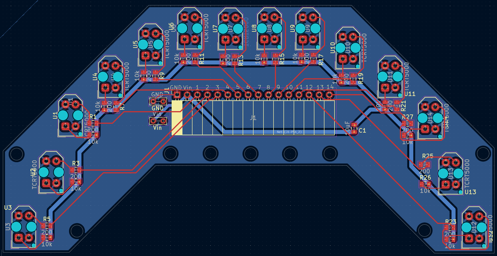
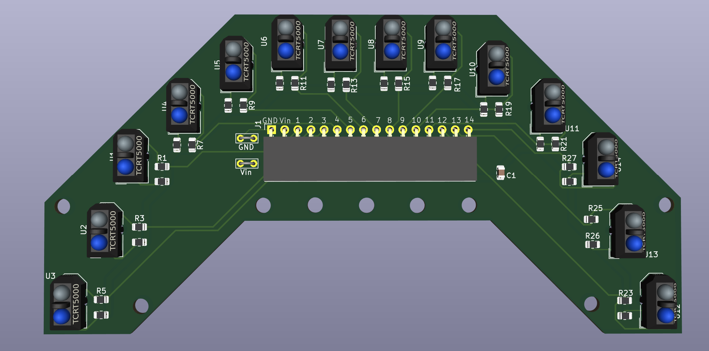

# 14-Channel QTR Sensor Array PCB

Custom 14-channel infrared sensor array PCB designed in KiCad for high-speed line follower robots and embedded robotics applications.

---

## Preview

### PCB Layout



### 3D View



---

## Features

- 14× TCRT5000 IR reflectance sensors
- Custom U-shaped curved PCB for wide-angle sensing
- Compact sensor spacing for accurate line detection
- Angled side sensors for better curve and junction detection
- Mounting holes for chassis integration
- Dedicated resistor network for each channel
  - 200Ω IR LED series resistor
  - 10kΩ pull-down resistor
- 16-pin single-row output header
- Analog output for all channels
- Compatible with any ADC-capable microcontroller
- Onboard decoupling capacitor for stable power delivery
- Designed in KiCad 9.0
- Gerber files included for fabrication

---

## Hardware Specifications

| Parameter | Value |
|---|---|
| Sensor Type | TCRT5000 |
| Sensor Count | 14 |
| LED Series Resistor | 200 Ω |
| Pull-down Resistor | 10 kΩ |
| Decoupling Capacitor | 100 nF |
| Supply Voltage | 5V |
| Output Type | Analog |
| Header Type | 16-pin 2.54mm single-row |
| PCB Type | 2-Layer Custom PCB |
| Software Used | KiCad 9.0 |
| Main Application | Line Follower Robotics |

---

## Bill of Materials (BOM)

| Reference | Component | Value | Quantity |
|---|---|---|---|
| U1–U14 | IR Reflectance Sensor | TCRT5000 | 14 |
| R1, R3, R5 ... R27 | LED Series Resistor | 200 Ω (0805) | 14 |
| R2, R4, R6 ... R28 | Pull-down Resistor | 10 kΩ (0805) | 14 |
| C1 | Decoupling Capacitor | 100 nF (0805) | 1 |
| J1 | Pin Header | 16-pin 2.54mm | 1 |
| — | Power Connector | Header / Screw Terminal | 1 |

---

## Pinout

| Pin | Signal | Description |
|---|---|---|
| 1 | GND | Ground |
| 2 | VIN | 5V Supply |
| 3–16 | CH1–CH14 | Analog sensor outputs |

---

## Project Structure

```text
.
├── Gerber new/
├── 14QRT_Custom_IR_Sensor_Improved.kicad_pcb
├── 14QRT_Custom_IR_Sensor_Improved.kicad_pro
├── 14QRT_Custom_IR_Sensor_Improved.kicad_prl
├── fp-info-cache
├── 3d_view.png
├── pcb_editor_view.png
└── README.md
```

---

## Circuit Description

Each channel uses a TCRT5000 infrared reflectance sensor with:

- 200 Ω current-limiting resistor for the IR LED
- 10 kΩ pull-down resistor for the phototransistor output

### IR LED Section

```text
5V ──[200Ω]──► IR LED ──► GND
```

### Phototransistor Section

```text
Collector ──► 5V
Emitter ──► [10kΩ] ──► GND
             │
             └──► Analog Output
```

### Sensor Behavior

| Surface Type | Sensor Output |
|---|---|
| White / Reflective Surface | LOW |
| Black / Non-reflective Surface | HIGH |

---

## Current Status

- PCB routing completed
- Gerber files generated
- Open-source repository published
- Additional improvements planned

---

## Future Improvements

### Hardware

- Add LM393 comparator stage for digital outputs
- Add adjustable threshold potentiometers
- Add onboard I2C ADC for reduced MCU ADC usage
- Add per-channel status LEDs
- Improve power filtering with bulk capacitors
- Add reverse polarity protection

### PCB Layout

- Cleaner routing and optimized power traces
- Better silkscreen labeling
- Dedicated test points for debugging
- Improved sensor wing geometry experiments

### Firmware

- Weighted centroid line position algorithm
- Auto-calibration routine
- PID controller examples for Arduino and STM32

---

## Applications

- High-speed line follower robots
- Autonomous navigation systems
- Embedded robotics platforms
- PID-based motion control systems
- Path tracking robots

---

## License

This project is released as open-source hardware.

---

Designed using KiCad 9.0 🚀
